## Intro Crackmes

[Download - challenges.zip](http://security.cs.rpi.edu/courses/binexp-spring2015/lectures/2/challenges.zip)

### Environment

- Kali Linux
- GNU bash，版本 5.0.3(1)-release (x86_64-pc-linux-gnu)

### Contents

<table>
<thead>
  <tr>
    <th colspan="2"><a href="#crackme0x00a">0x00a</a></th>
    <th colspan="3"><a href="#crackme0x00b">0x00b</a></th>
  </tr>
</thead>
<tbody>
  <tr>
    <td><a href="#crackme0x01">0x01</a></td>
    <td><a href="#crackme0x02">0x02</a></td>
    <td><a href="#crackme0x03">0x03</a></td>
    <td><a href="#crackme0x04">0x04</a></td>
    <td><a href="#crackme0x05">0x05</a></td>
  </tr>
</tbody>
<tbody>
  <tr>
    <td><a href="#crackme0x06">0x06</a></td>
    <td><a href="#crackme0x07">0x07</a></td>
    <td><a href="#crackme0x08">0x08</a></td>
    <td><a href="#crackme0x09">0x09</a></td>
    <td><a href="#"></a></td>
  </tr>
</tbody>
</table>

### crackme0x00a

```bash
$ file crackme0x00a
crackme0x00a: ELF 32-bit LSB executable, Intel 80386, version 1 (SYSV), dynamically linked, interpreter /lib/ld-, for GNU/Linux 2.6.15, BuildID[sha1]=a01d6d16a59c7f0d7ec00ab5454eed2eb22bd20d, not stripped
$ ./crackme0x00a
Enter password: 1234
Wrong!
Enter password: ^C
$ strings crackme0x00a
```
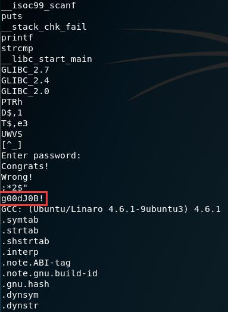
```bash
$ xxd crackme0x00a
```
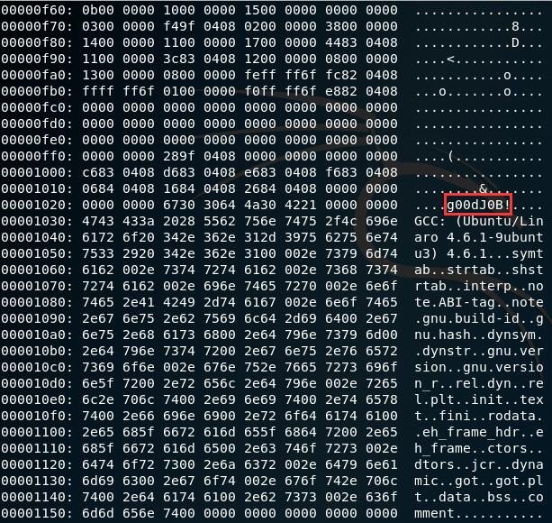
```bash
$ ./crackme0x00a
Enter password: g00dJ0B!
Congrats!
```

### crackme0x00b

```bash
$ file crackme0x00b
crackme0x00b: ELF 32-bit LSB executable, Intel 80386, version 1 (SYSV), dynamically linked, interpreter /lib/ld-linux.so.2, for GNU/Linux 2.6.15, BuildID[sha1]=bd4052c7de7891abb85e0087656d212119aadee0, not stripped
$ ./crackme0x00b
Enter password: 1234
Wrong!
Enter password: ^C

# 提示使用 -e 选项
# -e --encoding={s,S,b,l,B,L} Select character size and endianness:
# s = 7-bit, S = 8-bit, {b,l} = 16-bit, {B,L} = 32-bit

# 枚举后，可使用 {B,L} 获取密码
$ strings -e B crackme0x00b
w0wgreat
$ strings -e L crackme0x00b
w0wgreat

$ ./crackme0x00b
Enter password: w0wgreat
Congrats!
```

### crackme0x01

```bash
$ file crackme0x01
crackme0x01: ELF 32-bit LSB executable, Intel 80386, version 1 (SYSV), dynamically linked, interpreter /lib/ld-linux.so.2, for GNU/Linux 2.6.9, not stripped
$ ./crackme0x01
IOLI Crackme Level 0x01
Password: 1234
Invalid Password!

$ objdump -d crackme0x01 | grep -A 30 '<main>'
080483e4 <main>:
 80483e4:	55                   	push   %ebp
 80483e5:	89 e5                	mov    %esp,%ebp
 80483e7:	83 ec 18             	sub    $0x18,%esp
 80483ea:	83 e4 f0             	and    $0xfffffff0,%esp
 80483ed:	b8 00 00 00 00       	mov    $0x0,%eax
 80483f2:	83 c0 0f             	add    $0xf,%eax
 80483f5:	83 c0 0f             	add    $0xf,%eax
 80483f8:	c1 e8 04             	shr    $0x4,%eax
 80483fb:	c1 e0 04             	shl    $0x4,%eax
 80483fe:	29 c4                	sub    %eax,%esp
 8048400:	c7 04 24 28 85 04 08 	movl   $0x8048528,(%esp)
 8048407:	e8 10 ff ff ff       	call   804831c <printf@plt>
 804840c:	c7 04 24 41 85 04 08 	movl   $0x8048541,(%esp)
 8048413:	e8 04 ff ff ff       	call   804831c <printf@plt>
 8048418:	8d 45 fc             	lea    -0x4(%ebp),%eax
 804841b:	89 44 24 04          	mov    %eax,0x4(%esp)
 804841f:	c7 04 24 4c 85 04 08 	movl   $0x804854c,(%esp)
 8048426:	e8 e1 fe ff ff       	call   804830c <scanf@plt>
 804842b:	81 7d fc 9a 14 00 00 	cmpl   $0x149a,-0x4(%ebp)
 8048432:	74 0e                	je     8048442 <main+0x5e>  # 与 0x149a 比较，如果相等跳转
 8048434:	c7 04 24 4f 85 04 08 	movl   $0x804854f,(%esp)
 804843b:	e8 dc fe ff ff       	call   804831c <printf@plt>
 8048440:	eb 0c                	jmp    804844e <main+0x6a>
 8048442:	c7 04 24 62 85 04 08 	movl   $0x8048562,(%esp)
 8048449:	e8 ce fe ff ff       	call   804831c <printf@plt>
 804844e:	b8 00 00 00 00       	mov    $0x0,%eax
 8048453:	c9                   	leave
 8048454:	c3                   	ret
 8048455:	90                   	nop
 8048456:	90                   	nop
$ echo $((0x149a))
5274
$ ./crackme0x01
IOLI Crackme Level 0x01
Password: 5274
Password OK :)
```

### crackme0x02

```bash
$ file crackme0x02
crackme0x02: ELF 32-bit LSB executable, Intel 80386, version 1 (SYSV), dynamically linked, interpreter /lib/ld-linux.so.2, for GNU/Linux 2.6.9, not stripped
$ ./crackme0x02
IOLI Crackme Level 0x02
Password: 1234
Invalid Password!
```
使用 IDA Pro 将汇编代码还原成伪代码查看<br>
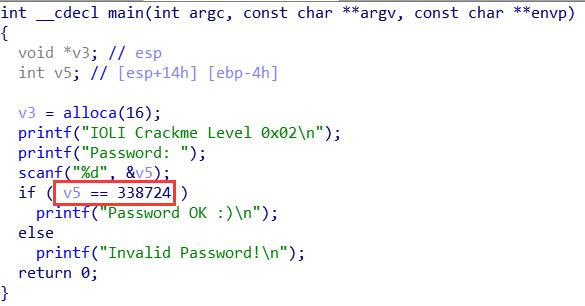

```bash
$ ./crackme0x02
IOLI Crackme Level 0x02
Password: 338724
Password OK :)
```

### crackme0x03

```bash
$ file crackme0x03
crackme0x03: ELF 32-bit LSB executable, Intel 80386, version 1 (SYSV), dynamically linked, interpreter /lib/ld-linux.so.2, for GNU/Linux 2.6.9, not stripped
$ ./crackme0x03
IOLI Crackme Level 0x03
Password: 1234
Invalid Password!
```

使用 IDA Pro 将汇编代码还原成伪代码查看，发现调用了函数`test`<br>
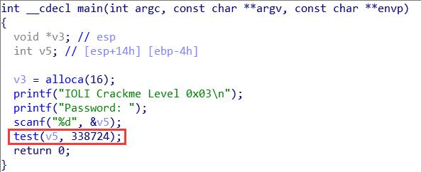

```c
int __cdecl test(int a1, int a2)
{
  int result; // eax

  if ( a1 == a2 )
    result = shift("Sdvvzrug#RN$$$#=,");
  else
    result = shift("Lqydolg#Sdvvzrug$");
  return result;
}

int __cdecl shift(char *s)
{
  size_t i; // [esp+1Ch] [ebp-7Ch]
  char v3[120]; // [esp+20h] [ebp-78h]

  for ( i = 0; i < strlen(s); ++i )
    v3[i] = s[i] - 3;
  v3[i] = 0;
  return printf("%s\n", v3);
}
```

使用工具 [ROT Cipher - Rotation - Rot Decoder, Encoder, Solver, Translator](https://www.dcode.fr/rot-cipher) 得到实际的字符串

```
Sdvvzrug#RN$$$#=, => Password~OK!!!~:)
Lqydolg#Sdvvzrug$ => Invalid~Password!
```

判断输入是否与 *338724* 相等，*338724* 即是 Level 0x03 的密码

```bash
$ ./crackme0x03
IOLI Crackme Level 0x03
Password: 338724
Password OK!!! :)
```

### crackme0x04

```bash
$ file crackme0x04
crackme0x04: ELF 32-bit LSB executable, Intel 80386, version 1 (SYSV), dynamically linked, interpreter /lib/ld-linux.so.2, for GNU/Linux 2.6.9, not stripped
$ ./crackme0x04
IOLI Crackme Level 0x04
Password: 123
Password Incorrect!
```

使用 IDA Pro 将汇编代码还原成伪代码查看，发现调用了函数`check`来检查输入的字符串<br>
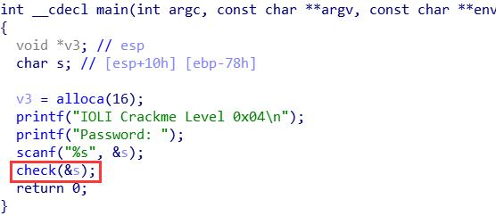<br>
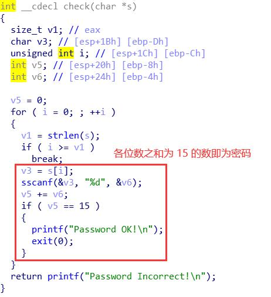

```bash
$ ./crackme0x04
IOLI Crackme Level 0x04
Password: 78
Password OK!

$ ./crackme0x04
IOLI Crackme Level 0x04
Password: 3444
Password OK!
```

### crackme0x05

```bash
$ file crackme0x05
crackme0x05: ELF 32-bit LSB executable, Intel 80386, version 1 (SYSV), dynamically linked, interpreter /lib/ld-linux.so.2, for GNU/Linux 2.6.9, not stripped
$ ./crackme0x05
IOLI Crackme Level 0x05
Password: 1234
Password Incorrect!
```

使用 IDA Pro 将汇编代码还原成伪代码查看，发现调用了函数`check`来检查输入的字符串<br>
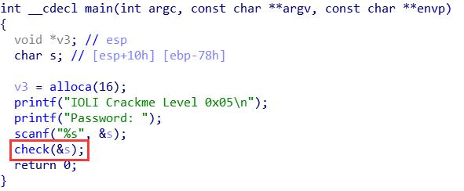

```c
int __cdecl check(char *s)
{
  size_t v1; // eax
  char v3; // [esp+1Bh] [ebp-Dh]
  unsigned int i; // [esp+1Ch] [ebp-Ch]
  int v5; // [esp+20h] [ebp-8h]
  int v6; // [esp+24h] [ebp-4h]

  v5 = 0;
  for ( i = 0; ; ++i )
  {
    v1 = strlen(s);
    if ( i >= v1 )
      break;
    v3 = s[i];
    sscanf(&v3, "%d", &v6);
    v5 += v6;
    if ( v5 == 16 ) // 各位数之和为 16
      parell(s);
  }
  return printf("Password Incorrect!\n");
}

int __cdecl parell(char *s)
{
  int result; // eax
  int v2; // [esp+14h] [ebp-4h]

  sscanf(s, "%d", &v2);
  result = v2 & 1;
  if ( !(v2 & 1) )  // 偶数
  {
    printf("Password OK!\n");
    exit(0);
  }
  return result;
}
```

各位数之和为 16 的偶数即为 Level 0x05 的密码

```bash
$ ./crackme0x05
IOLI Crackme Level 0x05
Password: 88
Password OK!

$ ./crackme0x05
IOLI Crackme Level 0x05
Password: 4444
Password OK!
```

### crackme0x06

```bash
$ file crackme0x06
crackme0x06: ELF 32-bit LSB executable, Intel 80386, version 1 (SYSV), dynamically linked, interpreter /lib/ld-linux.so.2, for GNU/Linux 2.6.9, not stripped
$ ./crackme0x06
IOLI Crackme Level 0x06
Password: 1234
Password Incorrect!
```

使用 IDA Pro 将汇编代码还原成伪代码查看，发现调用了函数`check`，传入的参数包括输入的字符串以及环境变量<br>
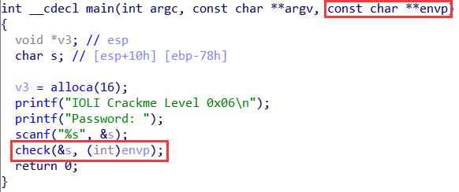

```c
int __cdecl check(char *s, int a2)
{
  size_t v2; // eax
  char v4; // [esp+1Bh] [ebp-Dh]
  unsigned int i; // [esp+1Ch] [ebp-Ch]
  int v6; // [esp+20h] [ebp-8h]
  int v7; // [esp+24h] [ebp-4h]

  v6 = 0;
  for ( i = 0; ; ++i )
  {
    v2 = strlen(s);
    if ( i >= v2 )
      break;
    v4 = s[i];
    sscanf(&v4, "%d", &v7);
    v6 += v7;
    if ( v6 == 16 ) // 各位数之和为 16
      parell(s, a2);
  }
  return printf("Password Incorrect!\n");
}

int *__cdecl parell(char *s, int a2)
{
  int *result; // eax
  int i; // [esp+10h] [ebp-8h]
  int v4; // [esp+14h] [ebp-4h]

  sscanf(s, "%d", &v4);
  result = (int *)dummy(v4, a2);
  if ( result )
  {
    for ( i = 0; i <= 9; ++i )  // 不能超过 10 个数字
    {
      if ( !(v4 & 1) )  // 偶数
      {
        printf("Password OK!\n");
        exit(0);
      }
      result = &i;
    }
  }
  return result;
}

signed int __cdecl dummy(int a1, int a2)
{
  int v2; // ecx
  int v5; // [esp+14h] [ebp-4h]

  // envp[i] = "NAME=value"
  v5 = 0;
  while ( *(_DWORD *)(4 * v5 + a2) )
  {
    v2 = 4 * v5++;
    // 查找是否有命名以 LOL 开头的环境变量，成功找到返回 1
    if ( !strncmp(*(const char **)(v2 + a2), "LOLO", 3u) )
      return 1;
  }
  return 0;
}
```

需要一个各位数之和为 16 且长度不超过 10 个数字的偶数以及一个命名以 LOL 开头的环境变量（值随意）

可通过`export`定义环境变量，但不必要。`NAME=value command`可创建一个作用域仅为执行该命令进程的环境变量

```bash
$ LOL=1 ./crackme0x06
IOLI Crackme Level 0x06
Password: 88
Password OK!

$ LOL=1 ./crackme0x06
IOLI Crackme Level 0x06
Password: 1111222222
Password OK!

$ LOL=1 ./crackme0x06
IOLI Crackme Level 0x06
Password: 111111111111112
Password Incorrect!

$ LOL= ./crackme0x06
IOLI Crackme Level 0x06
Password: 88
Password OK!

$ LOLABCD=1 ./crackme0x06
IOLI Crackme Level 0x06
Password: 88
Password OK!
```

参考：[environ(7) — Linux manual page](https://man7.org/linux/man-pages/man7/environ.7.html)

### crackme0x07

```bash
$ file crackme0x07
crackme0x07: ELF 32-bit LSB executable, Intel 80386, version 1 (SYSV), dynamically linked, interpreter /lib/ld-linux.so.2, for GNU/Linux 2.6.9, stripped
$ ./crackme0x07
IOLI Crackme Level 0x07
Password: 1234
Password Incorrect!
```

使用 IDA Pro 将汇编代码还原成伪代码查看，发现调用了一个函数，传入的参数包括输入的字符串以及环境变量<br>
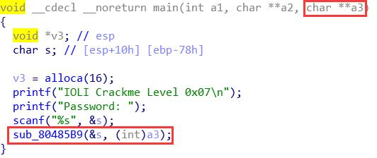

```c
void __cdecl __noreturn sub_80485B9(char *s, int a2)
{
  size_t v2; // eax
  char v3; // [esp+1Bh] [ebp-Dh]
  unsigned int i; // [esp+1Ch] [ebp-Ch]
  int v5; // [esp+20h] [ebp-8h]
  int v6; // [esp+24h] [ebp-4h]

  v5 = 0;
  for ( i = 0; ; ++i )
  {
    v2 = strlen(s);
    if ( i >= v2 )
      break;
    v3 = s[i];
    sscanf(&v3, "%d", &v6);
    v5 += v6;
    if ( v5 == 16 ) // 各位数之和为 16
      sub_8048542(s, a2);
  }
  sub_8048524();
}

void __noreturn sub_8048524()
{
  printf("Password Incorrect!\n");
  exit(0);
}

int *__cdecl sub_8048542(char *s, int a2)
{
  int *result; // eax
  int i; // [esp+10h] [ebp-8h]
  int v4; // [esp+14h] [ebp-4h]

  sscanf(s, "%d", &v4);
  result = (int *)sub_80484B4(v4, a2);
  if ( result )
  {
    for ( i = 0; i <= 9; ++i )  // 不能超过 10 个数字
    {
      if ( !(v4 & 1) )  // 偶数
      {
        if ( dword_804A02C == 1 )
          printf("Password OK!\n");
        exit(0);
      }
      result = &i;
    }
  }
  return result;
}

signed int __cdecl sub_80484B4(int a1, int a2)
{
  int v2; // ecx
  int v5; // [esp+14h] [ebp-4h]

  v5 = 0;
  while ( *(_DWORD *)(4 * v5 + a2) )
  {
    v2 = 4 * v5++;
    // 查找是否有命名以 LOL 开头的环境变量，成功找到返回 1
    if ( !strncmp(*(const char **)(v2 + a2), "LOLO", 3u) )
    {
      dword_804A02C = 1;  // 全局变量
      return 1;
    }
  }
  return 0;
}
```

与 [crackme0x06](#crackme0x06) 相比，crackme0x07 函数数量增加，并且剥掉了符号信息和调试信息（stripped），因此伪代码中没有特定的函数名

```bash
# 实际运行效果与 crackme0x06 一致
$ LOL=1 ./crackme0x07
IOLI Crackme Level 0x07
Password: 88
Password OK!
```

使用 *Shift + F12* 调出 *Strings window* 查看，发现输出字符串还有一个`wtf?\n`<br>
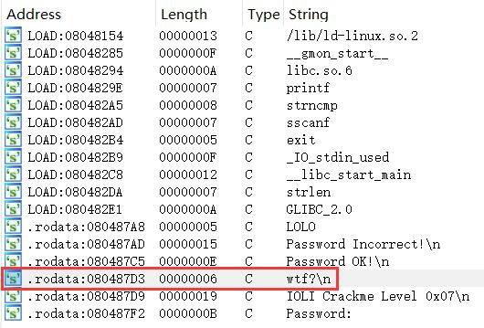
事实上，在不改动的情况下，这部分输出`wtf?\n`的代码并不会被执行<br>
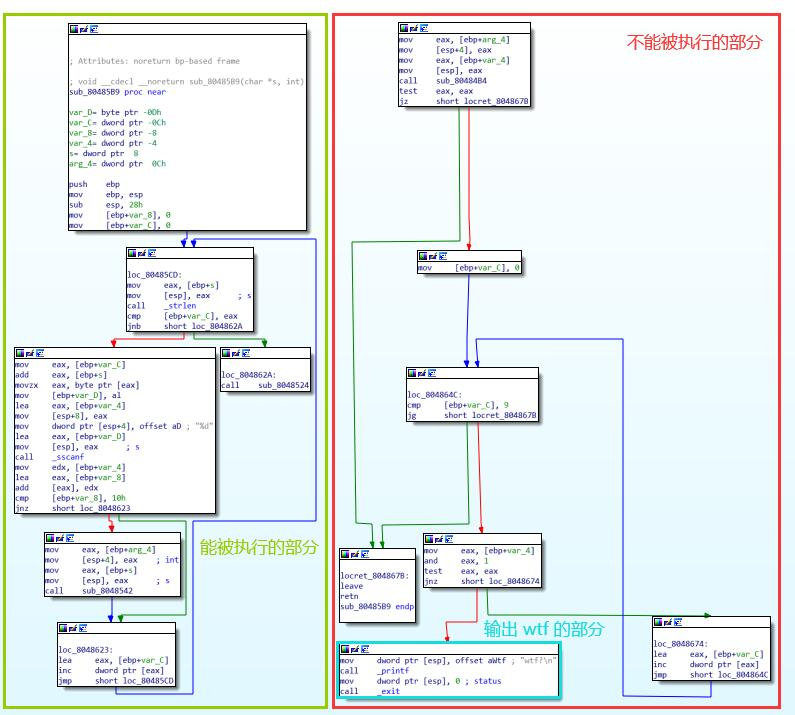

### crackme0x08

```bash
$ file crackme0x08
crackme0x08: ELF 32-bit LSB executable, Intel 80386, version 1 (SYSV), dynamically linked, interpreter /lib/ld-linux.so.2, for GNU/Linux 2.6.9, not stripped
$ ./crackme0x08
IOLI Crackme Level 0x08
Password: 1234
Password Incorrect!
```

使用 IDA Pro 将汇编代码还原成伪代码查看，发现调用了函数`check`，传入参数包括输入的字符串以及环境变量<br>
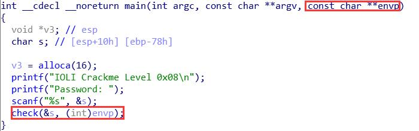

```c
void __cdecl __noreturn check(char *s, int a2)
{
  size_t v2; // eax
  char v3; // [esp+1Bh] [ebp-Dh]
  unsigned int i; // [esp+1Ch] [ebp-Ch]
  int v5; // [esp+20h] [ebp-8h]
  int v6; // [esp+24h] [ebp-4h]

  v5 = 0;
  for ( i = 0; ; ++i )
  {
    v2 = strlen(s);
    if ( i >= v2 )
      break;
    v3 = s[i];
    sscanf(&v3, "%d", &v6);
    v5 += v6;
    if ( v5 == 16 ) // 各位数之和为 16
      parell(s, a2);
  }
  che();
}

void __noreturn che()
{
  printf("Password Incorrect!\n");
  exit(0);
}

int *__cdecl parell(char *s, int a2)
{
  int *result; // eax
  int i; // [esp+10h] [ebp-8h]
  int v4; // [esp+14h] [ebp-4h]

  sscanf(s, "%d", &v4);
  result = (int *)dummy(v4, a2);
  if ( result )
  {
    for ( i = 0; i <= 9; ++i )  // 不能超过 10 个数字
    {
      if ( !(v4 & 1) )  // 偶数
      {
        if ( LOL == 1 )
          printf("Password OK!\n");
        exit(0);
      }
      result = &i;
    }
  }
  return result;
}

signed int __cdecl dummy(int a1, int a2)
{
  int v2; // ecx
  int v5; // [esp+14h] [ebp-4h]

  v5 = 0;
  while ( *(_DWORD *)(4 * v5 + a2) )
  {
    v2 = 4 * v5++;
    // 查找是否有命名以 LOL 开头的环境变量，成功找到返回 1，
    // 全局变量 LOL 置为 1
    if ( !strncmp(*(const char **)(v2 + a2), "LOLO", 3u) )
    {
      LOL = 1;
      return 1;
    }
  }
  return 0;
}
```

crackme0x08 就是 [crackme0x07](#crackme0x07) 的 not-stripped 版本

```bash
# 实际运行效果与 crackme0x07 一致
$ LOL=1 ./crackme0x08
IOLI Crackme Level 0x08
Password: 88
Password OK!
```